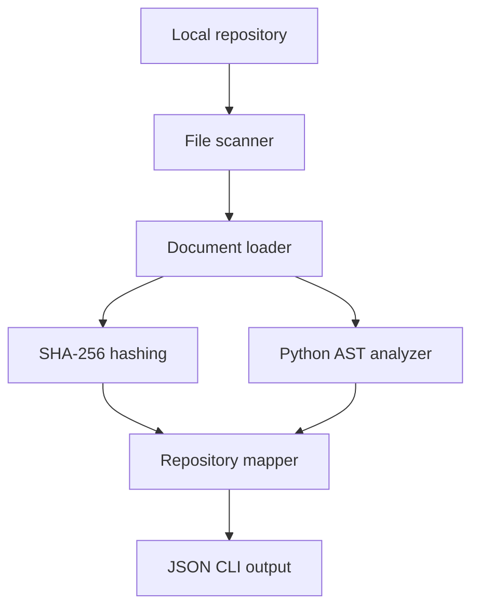
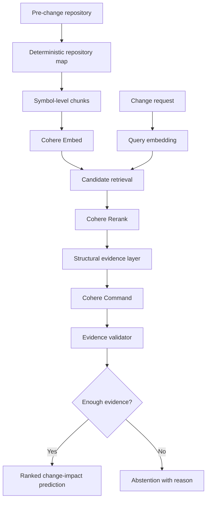

# System Architecture

## Status

Current and planned architecture for the evidence-grounded change-impact prototype.

## Design principle

Deterministic repository evidence must be created before any model is asked to reason about a proposed change.

The language model must not be treated as the source of truth for repository structure, file existence, symbols, imports or historical changes.

## Current architecture

## Current components

### File scanner

Location: `src/cohere_workshops/scanner.py`

Responsibilities:

- Recursively discover supported files
- Exclude generated and dependency directories
- Return files in deterministic order
- Reject invalid repository paths

### Document loader

Location: `src/cohere_workshops/documents.py`

Responsibilities:

- Read repository files as UTF-8 text
- Record repository-relative paths
- Detect the language from the file extension
- Generate stable SHA-256 content hashes

### Python structure analyzer

Location: `src/cohere_workshops/structure.py`

Responsibilities:

- Parse Python source using `ast`
- Extract functions and classes
- Extract imports
- Record source line numbers
- Reject non-Python documents

### Repository mapper

Location: `src/cohere_workshops/mapper.py`

Responsibilities:

- Coordinate file discovery and document loading
- Apply structural analysis to Python files
- Create one deterministic repository map
- Keep non-Python files without invented structure

### Command-line interface

Location: `src/cohere_workshops/cli.py`

Responsibilities:

- Accept a local repository path
- Build the repository map
- Serialize the map as JSON
- Write results to standard output

### Cohere practice request

Location: `src/cohere_workshops/hello_cohere.py`

Responsibilities:

- Load the private Cohere API key
- Create a Cohere `ClientV2`
- Make one minimal Chat request
- Confirm that the SDK and credentials work

This module is a connection test and is not part of the change-impact pipeline.

## Current data flow

1. A repository path enters the command-line interface.
2. The scanner discovers supported files.
3. The document loader reads and hashes each file.
4. Python files are parsed with the AST analyzer.
5. The mapper combines document and structural evidence.
6. The CLI returns the map as JSON.

## Current repository map

Each mapped file contains:

- Repository-relative path
- Detected language
- SHA-256 content hash
- Extracted symbols
- Extracted imports

Each extracted symbol contains:

- Name
- Kind
- Starting line number

## Planned architecture

## Planned components

### Chunking layer

Will divide repository content into stable, traceable units such as:

- File summaries
- Classes
- Functions
- Methods
- Tests
- Configuration sections
- Documentation sections

Every chunk must retain its file path, line range, content hash and structural metadata.

### Cohere Embed layer

Will create separate embeddings for:

- Repository documents using `search_document`
- Change requests using `search_query`

The first implementation will use Cohere `embed-v4.0`.

Raw source content must remain traceable to its embedding record.

### Candidate retrieval layer

Will rank repository chunks using vector similarity and return a configurable candidate set.

Retrieval must preserve:

- Chunk identifier
- Source path
- Line range
- Similarity score
- Content hash

### Cohere Rerank layer

Will rerank the retrieved candidates against the original change request.

Reranking must not introduce files that were absent from the retrieved candidate set.

### Structural evidence layer

Will combine semantic relevance with deterministic relationships such as:

- Imports
- Symbol ownership
- Test-to-source relationships
- Configuration references
- File paths
- Dependency direction

### Cohere Command layer

Will produce a structured prediction containing:

- Predicted files
- Predicted symbols
- Predicted tests
- Evidence references
- Confidence
- Unresolved questions
- Abstention status and reason

### Evidence validator

Will verify that:

- Every predicted file exists
- Every predicted symbol exists
- Every evidence reference points to retrieved repository content
- Scores fall within the permitted range
- Required fields are present
- Unsupported claims are rejected

## Deterministic and model boundaries

| Deterministic responsibilities | Model-assisted responsibilities |
| --- | --- |
| File discovery | Semantic similarity |
| File existence | Candidate reranking |
| Content hashing | Natural-language explanation |
| AST parsing | Change-impact reasoning |
| Symbol existence | Uncertainty description |
| Import extraction | Structured prediction |
| Diff-based ground truth | Recommended investigation order |
| Metric calculation | None of the ground-truth calculation |

## Security boundaries

- Cohere API keys remain in `.env`.
- `.env` is excluded from Git.
- Repository content is sent to Cohere only by explicit application actions.
- Tests must use fixtures or mocks.
- Tests must never make live API requests.
- Private repositories are outside the initial research scope.
- Secrets and unsupported binary files must not be indexed.
- Logs must not contain API keys.

## Reproducibility requirements

Every generated result must be traceable to:

- Repository URL
- Repository commit
- File content hash
- Chunk identifier
- Model name
- Request configuration
- Application commit
- Experiment identifier

## Known limitations

The current implementation:

- Performs structural parsing only for Python
- Reads complete UTF-8 files
- Does not yet respect every repository-specific ignore rule
- Does not enforce file-size limits
- Does not detect secrets before processing
- Does not create symbol-level chunks
- Does not persist repository maps
- Does not call Cohere Embed or Rerank
- Does not predict code changes